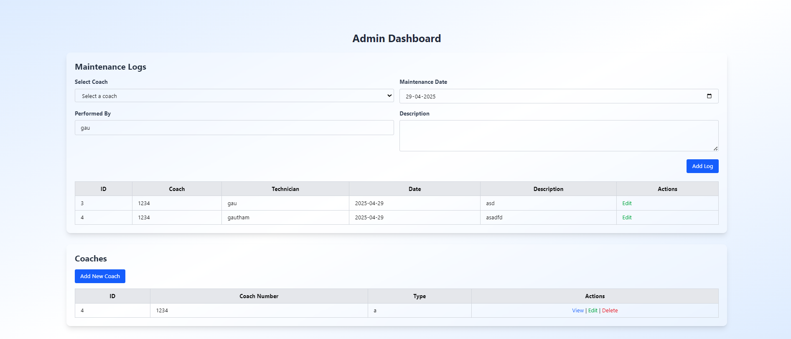
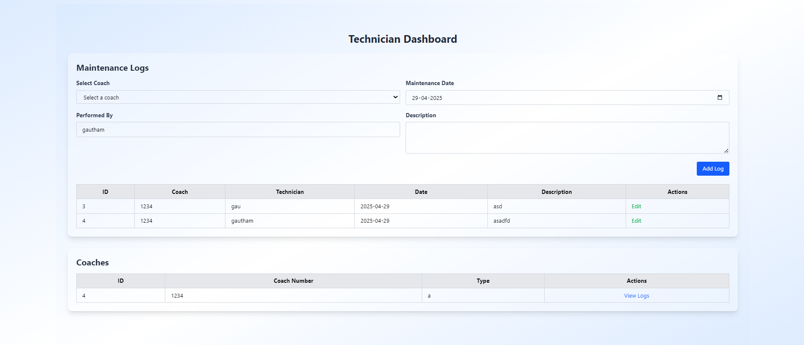
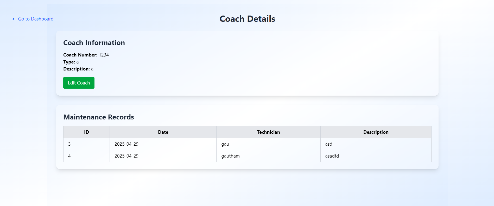

# 🛠️ Railway Coach Maintenance Log System

A full-stack Laravel-based web application for managing railway coaches and maintenance logs with role-based dashboards for Admins and Technicians.

---

## 🚀 Features

-   Role-based login system (Admin & Technician)
-   Secure authentication with hashed passwords
-   Admin Dashboard:
    -   View all coaches and their maintenance records
    -   Full CRUD operations on Coaches
    -   View all maintenance logs with technician info
-   Technician Dashboard:
    -   View own logs
    -   Add new maintenance logs
-   Resource controllers & clean route structure
-   TailwindCSS-based responsive UI
-   Uses Laravel's latest standards (Laravel 11/12+ compatible)

---

## 📁 Folder Structure

```

app/
├── Http/
│ ├── Controllers/
│ │ ├── AuthController.php
│ │ ├── DashboardController.php
│ │ ├── CoachController.php
│ │ └── MaintenanceLogController.php
│ └── Middleware/
│ └── RoleMiddleware.php
├── Models/
│ ├── User.php
│ ├── Coach.php
│ └── MaintenanceLog.php
resources/
├── views/
│ ├── auth/
│ │ ├── login.blade.php
│ ├── dashboards/
│ │ ├── admin.blade.php
│ │ └── technician.blade.php
│ ├── coaches/
│ └── maintenance-logs/
routes/
└── web.php

```

---

## 🧾 Database Schema

### 🔐 Users Table

| Column     | Type      | Description             |
| ---------- | --------- | ----------------------- |
| id         | INT       | Primary Key             |
| name       | STRING    | Full name               |
| username   | STRING    | Unique username         |
| password   | STRING    | Hashed password         |
| role       | ENUM      | `admin` or `technician` |
| created_at | TIMESTAMP |                         |
| updated_at | TIMESTAMP |                         |

### 🛤️ Coaches Table

| Column       | Type      | Description                   |
| ------------ | --------- | ----------------------------- |
| id           | INT       | Primary Key                   |
| coach_number | STRING    | Unique coach identifier       |
| coach_type   | STRING    | Type (e.g., Sleeper, AC, etc) |
| description  | TEXT      | Optional                      |
| created_at   | TIMESTAMP |                               |
| updated_at   | TIMESTAMP |                               |

### 🧰 Maintenance Logs Table

| Column           | Type      | Description                    |
| ---------------- | --------- | ------------------------------ |
| id               | INT       | Primary Key                    |
| coach_id         | INT       | Foreign Key → coaches(id)      |
| performed_by     | STRING    | Name of the technician         |
| maintenance_date | DATE      | Date of maintenance            |
| description      | TEXT      | Description of the maintenance |
| created_at       | TIMESTAMP |                                |
| updated_at       | TIMESTAMP |                                |

---

## 🧑‍💻 Installation & Setup

> This assumes you already have PHP, Composer, Node.js, and MySQL installed.

### 1. Clone the Repo

```bash
git clone https://github.com/friedavocadoes/Railway-Coach-Profile
cd Railway-Coach-Profile
```

### 2. Install PHP Dependencies

```bash
composer install
```

### 3. Install Node (Tailwind) Dependencies

```bash
npm install
```

### 4. Environment Setup

```bash
cp .env.example .env
php artisan key:generate
```

> ⚠️ Update your `.env` file with DB credentials.

```
DB_DATABASE=your_db
DB_USERNAME=root
DB_PASSWORD=your_password
```

### 5. Run Migrations

```bash
php artisan migrate
```

### 6. Seed an Admin & Technician User

> You can manually add users through Tinker or create a seeder if needed.

```bash
php artisan tinker

>>> \App\Models\User::create([
    'name' => 'Admin',
    'email' => 'admin@example.com',
    'password' => bcrypt('password'),
    'role' => 'admin'
]);

>>> \App\Models\User::create([
    'name' => 'Technician',
    'email' => 'tech@example.com',
    'password' => bcrypt('password'),
    'role' => 'technician'
]);
```

### 7. Run Tailwind Watcher

```bash
npm run dev
```

### 8. Serve Laravel

```bash
php artisan serve
```

Then visit:  
🔗 `http://localhost:8000`

---

## 🔐 Authentication Flow

-   `POST /login` → AuthController handles login
-   On success, Laravel session stores user info & role
-   `GET /dashboard` → Role is checked
    -   `admin` → Redirect to Admin Dashboard
    -   `technician` → Redirect to Technician Dashboard

---

## 🛡️ Middleware

Custom middleware to check user role:

```php
public function handle($request, Closure $next, $role)
{
    if (auth()->user()->role !== $role) {
        abort(403, 'Unauthorized.');
    }

    return $next($request);
}
```

---

## 🔄 Route Structure

```php
Route::get('/', function () {
    return view('auth.login');
});

Route::post('/login', [AuthController::class, 'login'])->name('login');

Route::middleware('auth')->group(function () {
    Route::get('/dashboard', [DashboardController::class, 'index'])->name('dashboard');

    Route::middleware('role:admin')->group(function () {
        Route::resource('coaches', CoachController::class);
        Route::resource('maintenance-logs', MaintenanceLogController::class);
    });

    Route::middleware('role:technician')->group(function () {
        Route::get('/my-logs', [MaintenanceLogController::class, 'myLogs'])->name('logs.mine');
        Route::post('/maintenance-logs', [MaintenanceLogController::class, 'store'])->name('logs.store');
    });
});
```

---

## 📷 Screenshots

#### Admin Dashboard



#### Technician Dashboard



#### View Coach



## 📚 Credits

Made with ❤️ using:

-   Laravel 12+
-   TailwindCSS
-   MySQL
-   PHP 8+

---

## 🪲 Troubleshooting

-   **White screen?**  
    Check `.env` file and `storage/logs/laravel.log`.

-   **CSS not loading?**  
    Make sure `npm run dev` is running. Or try `npm run build`.

-   **Login not working?**  
    Double-check users exist in DB and passwords are hashed.

---

## 📜 License

MIT © Gautham Madhu

# About Laravel

<p align="center"><a href="https://laravel.com" target="_blank"></a></p>

<p align="center">
<a href="https://github.com/laravel/framework/actions"></a>
<a href="https://packagist.org/packages/laravel/framework"></a>
<a href="https://packagist.org/packages/laravel/framework"></a>
<a href="https://packagist.org/packages/laravel/framework"></a>
</p>

## About Laravel

Laravel is a web application framework with expressive, elegant syntax. We believe development must be an enjoyable and creative experience to be truly fulfilling. Laravel takes the pain out of development by easing common tasks used in many web projects, such as:

-   [Simple, fast routing engine](https://laravel.com/docs/routing).
-   [Powerful dependency injection container](https://laravel.com/docs/container).
-   Multiple back-ends for [session](https://laravel.com/docs/session) and [cache](https://laravel.com/docs/cache) storage.
-   Expressive, intuitive [database ORM](https://laravel.com/docs/eloquent).
-   Database agnostic [schema migrations](https://laravel.com/docs/migrations).
-   [Robust background job processing](https://laravel.com/docs/queues).
-   [Real-time event broadcasting](https://laravel.com/docs/broadcasting).

Laravel is accessible, powerful, and provides tools required for large, robust applications.

## Learning Laravel

Laravel has the most extensive and thorough [documentation](https://laravel.com/docs) and video tutorial library of all modern web application frameworks, making it a breeze to get started with the framework.

You may also try the [Laravel Bootcamp](https://bootcamp.laravel.com), where you will be guided through building a modern Laravel application from scratch.

If you don't feel like reading, [Laracasts](https://laracasts.com) can help. Laracasts contains thousands of video tutorials on a range of topics including Laravel, modern PHP, unit testing, and JavaScript. Boost your skills by digging into our comprehensive video library.

## Laravel Sponsors

We would like to extend our thanks to the following sponsors for funding Laravel development. If you are interested in becoming a sponsor, please visit the [Laravel Partners program](https://partners.laravel.com).

### Premium Partners

-   **[Vehikl](https://vehikl.com/)**
-   **[Tighten Co.](https://tighten.co)**
-   **[Kirschbaum Development Group](https://kirschbaumdevelopment.com)**
-   **[64 Robots](https://64robots.com)**
-   **[Curotec](https://www.curotec.com/services/technologies/laravel/)**
-   **[DevSquad](https://devsquad.com/hire-laravel-developers)**
-   **[Redberry](https://redberry.international/laravel-development/)**
-   **[Active Logic](https://activelogic.com)**

## Contributing

Thank you for considering contributing to the Laravel framework! The contribution guide can be found in the [Laravel documentation](https://laravel.com/docs/contributions).

## Code of Conduct

In order to ensure that the Laravel community is welcoming to all, please review and abide by the [Code of Conduct](https://laravel.com/docs/contributions#code-of-conduct).

## Security Vulnerabilities

If you discover a security vulnerability within Laravel, please send an e-mail to Taylor Otwell via [taylor@laravel.com](mailto:taylor@laravel.com). All security vulnerabilities will be promptly addressed.

## License

The Laravel framework is open-sourced software licensed under the [MIT license](https://opensource.org/licenses/MIT).

Absolutely, here's a full-blown, professional-level README in Markdown for your Laravel + Tailwind + Role-Based Maintenance Log Project. This covers setup, tech stack, DB structure, login flow, role-based dashboard logic, and more — basically the whole damn thing.

---
